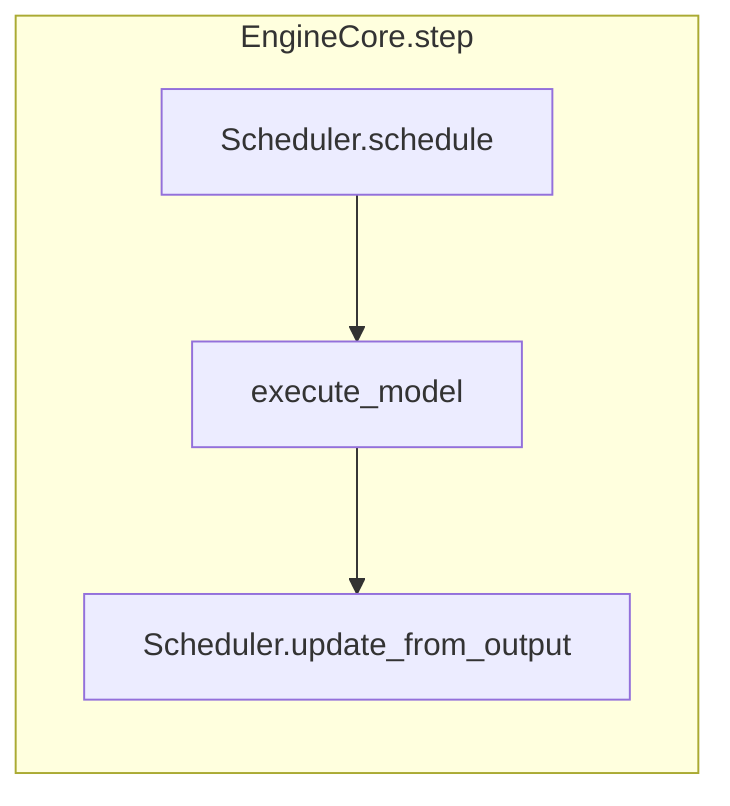

# V1：LMCache + Token 稀疏 + Eager 下的 Prefill / Decode 流程

面向「用 `LMCacheConnectorV1`、`LMCACHE_*`、`--sparse-attention`（如 `cluster_granularity: token`）、`--enforce-eager` 等启动的 OpenAI 兼容 server」，说明 **Prefill 阶段** 与 **Decode 阶段** 在调度与模型侧**分别**会走什么逻辑。

实现上 V1 调度器**没有**命名为 `prefill()` / `decode()` 的两套 API，而是每步用 `num_scheduled_tokens` 追平序列；下面用**你能在行为上区分的两阶段**来描述。

**判据（足够用来对齐下文）：**

- **Prefill**：该请求**还没有任何已提交的输出 token**，或仍在把 prompt（及可能的占位）算进 KV；代码里常对应 `num_output_tokens == 0` 且仍在吃 prompt 的连续若干步（可能被 **chunked prefill** 拆成多步），或 `Request.is_prefill_chunk` 仍为 true。
- **Decode**：prompt 已吃完，本步主要在算**新生成的 1 个 query token**（spec decode 时可能多几个 draft）；通常每步每请求 `num_scheduled_tokens` 为 **1**（外加 spec 相关占位）。

更通用的说明见 [`docs/usage/v1_guide.md`](../usage/v1_guide.md)；英文实现索引见文末 *Source map*。

---

## 单次引擎步（两阶段共用骨架）

每一「步」都是 [`EngineCore.step`](../../vllm/v1/engine/core.py)：

1. `scheduler_output = scheduler.schedule()`
2. `execute_model(scheduler_output)`（worker 上跑 transformer）
3. （可选）grammar bitmask
4. `scheduler.update_from_output(scheduler_output, model_output)`

Prefill / Decode **共用**这条骨架；差别在 `schedule()` 算的「本步每个请求要算几个 token」、KV 块怎么长、以及注意力是 **prefill 形状**还是 **decode + 稀疏 gather**。

---

## Prefill 阶段：执行什么样的流程

适用于：请求刚从 WAITING 进入 RUNNING，直到 prompt（可能分多步）全部进入 `num_computed_tokens`。

### 调度器（Scheduler）

1. **新请求**（WAITING）  
   - 先做 **vLLM 本地块命中**：`kv_cache_manager.get_computed_blocks`。你使用 **`--no-enable-prefix-caching`** 时，这段本地前缀命中通常**不起作用或极弱**（仍会做接口调用，但不要指望像开 prefix cache 那样的命中）。  
   - 若有 **`LMCacheConnectorV1`**：`connector.get_num_new_matched_tokens`，得到 **LMCache 里已存在的 KV 长度**，记到 `num_external_computed_tokens`。  
   - 若需 **异步拉 KV**：`load_kv_async` → 请求进 **`WAITING_FOR_REMOTE_KVS`**，**本步可以不跑模型**（scheduled tokens 为 0）；等 worker 在后续步的 `KVConnectorOutput.finished_recving` 报到后，再从 WAITING 调度。

2. **决定要算多少 prompt token**  
   - 典型为一步内 `num_scheduled_tokens[rid] = min(缺口, token_budget, chunked_prefill 上限 …)`，因此 **长 prompt 会多步 Prefill**（chunked prefill）。  
   - **稀疏 KV 管理器**：对新请求在 prefill 路径下按 **整段 prompt** 做**顺序分页分配**（[`SparseKVManager`](../../vllm/v1/core/sparse_kv_cache_manager.py)：`allocate_new_blocks` 在「尚未进入 decode 模式」时走父类式整段分配），**不会**走 decode 那块「只盯历史子集 + 当前 decode 块」的逻辑。

3. **构造本步 `SchedulerOutput`**  
   - **`kv_connector_metadata`**：`connector.build_connector_meta(...)`，带上本步 LMCache 需要知道的 load/save 计划。  
   - **Token 稀疏 + `use_compact_kv_gather`（默认 true）**：[`delegates_token_selection_to_runner`](../../vllm/v1/core/sparse_kv_cache_manager.py) 为 true 时，**CPU 侧不向 `CachedRequestData` 塞一整套 `sparse_selected_*` 索引**；decode 时的 token 选择在 **GPU runner** 上做。Prefill 步主要仍是 **写入整段 prompt 的 KV**，注意力内核走 **prefill 类**路径（与具体 Flash 实现有关，见 [`flash_attn.py`](../../vllm/v1/attention/backends/flash_attn.py)）。

4. **`_update_after_schedule`**：已调度请求的 `num_computed_tokens` 先加上本步要算的长度（用于下一步继续 chunk）。

### 模型侧（GPUModelRunner + 模型）

1. **`execute_model`**：`bind_connector_metadata`、`start_load_kv`（LMCache 按需把外部 KV 搬进 paged buffer）、`set_forward_context` 里跑 **`_model_forward` → `model(...)`**。  
2. **`--enforce-eager`**：不做 **FULL** CUDA Graph 整图回放；每步动态 launch kernel。  
3. **每层注意力**（`LMCACHE_USE_LAYERWISE=true` 且启用 v1 KV transfer 时，经 [`maybe_transfer_kv_layer`](../../vllm/model_executor/layers/attention/kv_transfer_utils.py)）：  
   - **`wait_for_layer_load(layer_name, …)`**：本层 KV 若需从 LMCache 侧对齐/填充，先等到可算。  
   - 标准 attention 前向（prefill：多 query token、写 KV）。  
   - **`save_kv_layer`**：把本层 paged KV **异步/按 chunk 策略**推到 LMCache（`LMCACHE_CHUNK_SIZE`、`LMCACHE_SAVE_UNFULL_CHUNK` 等影响是否保存未满 chunk，见 [`LMCacheConnectorV1Impl`](../../vllm/distributed/kv_transfer/kv_connector/v1/lmcache_integration/vllm_v1_adapter.py)）。  
4. **forward 结束**：`wait_for_save`、`get_finished`、`invalid_block_ids` 等打进 `KVConnectorOutput`。  
5. **采样**：Prefill 的最后阶段会产出 **第一个** 输出 token；中间 chunk 若不算「最后一步 prefill」，则可能主要更新 KV 与 logits 相关状态（视 `prompt_logprobs` 等而定）。

### Prefill 小结（你关心的「长什么样」）

| 环节 | Prefill 时在做什么 |
|------|-------------------|
| Scheduler | 按块算还要吃多少 **prompt token**，处理 **LMCache 命中长度**与可能的 **WAITING_FOR_REMOTE_KVS** |
| 稀疏 KV | **整段 prompt** 顺序占位，不是 decode 的子集 gather 分配 |
| 模型 | **多 token 前向**（可能多步 chunk），**每层** LMCache load/save |

---

## Decode 阶段：执行什么样的流程

适用于：`num_output_tokens > 0`（已经产生过采样结果），每步通常只推进 **一个新 token**。

### 调度器

1. 从 **RUNNING** 队列取请求，计算 `num_new_tokens`；稳态 decode 多为 **1**。  
2. **`allocate_slots`**：**稀疏 KV** 进入「decode 形态」：保留 **历史块**供检索、维护 **当前 decode 块** rollover，**不在 decode 里随便丢历史块**（见 [`SparseKVManager.allocate_new_blocks`](../../vllm/v1/core/sparse_kv_cache_manager.py)）。  
3. **`_make_cached_request_data`**：token + compact gather 模式下 **scheduler 不写满** `sparse_selected_*`；decode 的 **token 选择与 gather**在 runner。若某步稀疏元数据尚未就绪，调度器会用 `sparse_ensure_decode_selection` 等兜底（见 [`scheduler.py`](../../vllm/v1/core/sched/scheduler.py)）。  
4. 同样带 **`kv_connector_metadata`**，`build_connector_meta` 描述本步 LMCache 与哪些请求、哪些块交互。  

### 模型侧

1. **`_prepare_inputs` / `_build_attention_metadata`**：构造 **decode** 形状 + **稀疏**路径需要的 metadata（runner 侧 Q、质心、static 窗口等参与 Top-K / gather，与你的 JSON 里 `static_pattern_start/end`、`num_clusters`、`nprobe`、`max_selected_tokens` 等相关，细节在 Flash 后端）。  
2. **Attention**：对每个 decode 步，从历史 KV 里 **按稀疏策略选一子集**再算注意力（compact gather：**GPU 上**完成与 LMCache chunk 并存）。  
3. **LMCache layerwise**：仍然在**每一层** `wait_for_layer_load` → 算 QKV/attn → `save_kv_layer`（decode 也会持续往 LMCache **按 chunk 写**，是否写满取决于配置与连接器策略）。  
4. **`enforce-eager`**：同上，decode 仍走 eager kernel，不做整图回放。  
5. **`sample_tokens`**：对已算好的 logits **采样下一个 token**，`update_from_output` 回收 KV 连接器 `finished_*`、处理加载失败 block 等。

### Decode 小结

| 环节 | Decode 时在做什么 |
|------|-------------------|
| Scheduler | 多数步 **每请求 1 token**；稀疏管理器维护 **可选历史块 + decode 当前块** |
| 稀疏 | **Token 粒度 + compact gather**：**GPU runner** 负责选检索子集；`static_pattern_*` 等约束窗口 |
| LMCache | 每层仍 **load/save**；异步完成通过 `KVConnectorOutput` 驱动 scheduler 块生命周期 |

---

## 与你的启动参数的直接对应（速查）

| 配置 | Prefill 上 | Decode 上 |
|------|------------|-----------|
| `LMCacheConnectorV1` + `kv_both` | 命中则少算 prompt；可能 `WAITING_FOR_REMOTE_KVS` | 继续按层 save/load，与块释放由 `finished_*` 协调 |
| `LMCACHE_USE_LAYERWISE=true` | 每层 `wait_for_layer_load` / `save_kv_layer` | 同样每层 |
| `LMCACHE_CHUNK_SIZE` / `SAVE_UNFULL_CHUNK` | 影响写入 LMCache 的切段与是否保留未满段 | 同左 |
| `--no-enable-prefix-caching` | **只关 vLLM 前缀缓存**；**不关** LMCache 外部匹配 | 同左 |
| `--sparse-attention`（token + 默认 compact gather） | 主要 **填满 prompt KV**（整段分页） | **子集 KV attention** + runner 侧选 token |
| `--enforce-eager` | 无 FULL CUDA Graph | 无 FULL CUDA Graph |

---

## Source map（实现索引，英文）

| Area | File |
|------|------|
| Engine step | [`vllm/v1/engine/core.py`](../../vllm/v1/engine/core.py) — `step` |
| Scheduling | [`vllm/v1/core/sched/scheduler.py`](../../vllm/v1/core/sched/scheduler.py) — `schedule`, `_make_cached_request_data`, `update_from_output`, `_update_from_kv_xfer_finished` |
| Worker | [`vllm/v1/worker/gpu_model_runner.py`](../../vllm/v1/worker/gpu_model_runner.py) — `execute_model`, `_model_forward`, `_update_states` |
| KV connector context | [`vllm/v1/worker/kv_connector_model_runner_mixin.py`](../../vllm/v1/worker/kv_connector_model_runner_mixin.py) |
| Per-layer KV hooks | [`vllm/model_executor/layers/attention/kv_transfer_utils.py`](../../vllm/model_executor/layers/attention/kv_transfer_utils.py) |
| Sparse KV manager | [`vllm/v1/core/sparse_kv_cache_manager.py`](../../vllm/v1/core/sparse_kv_cache_manager.py) |
| Flash sparse backend | [`vllm/v1/attention/backends/flash_attn.py`](../../vllm/v1/attention/backends/flash_attn.py) |

